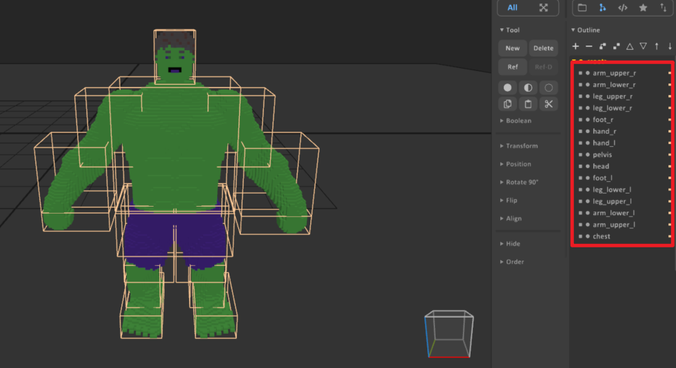
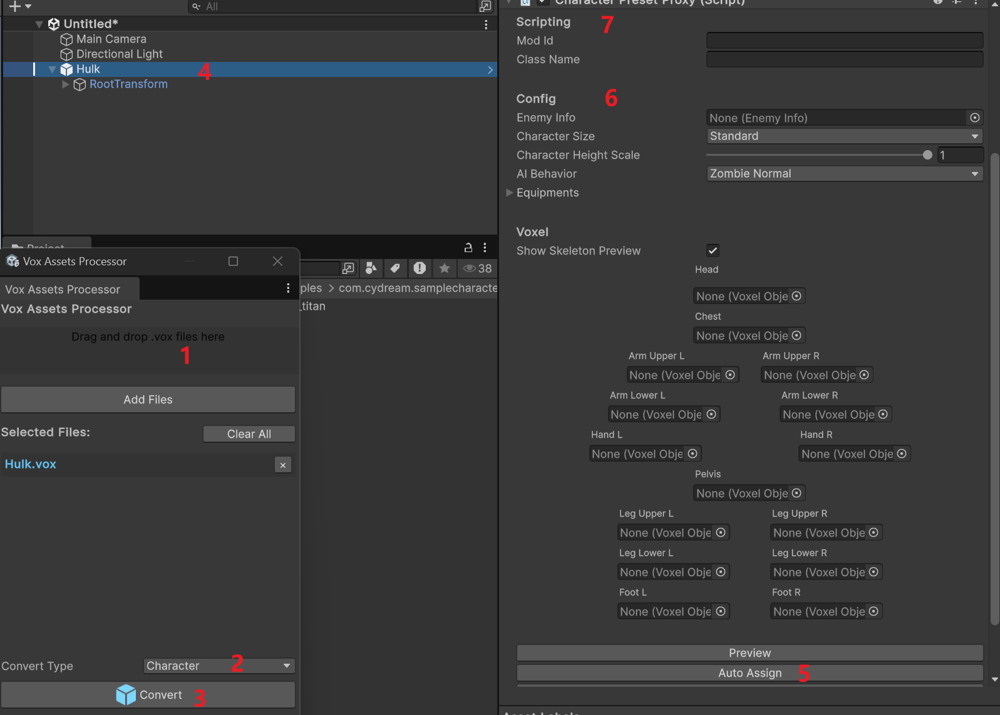
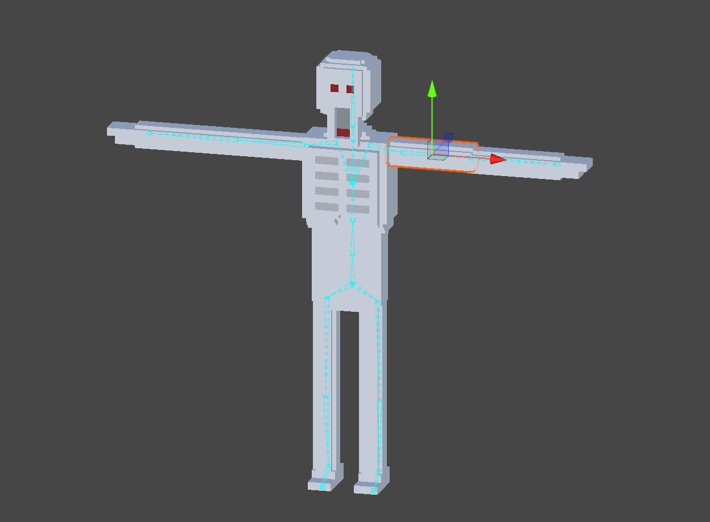
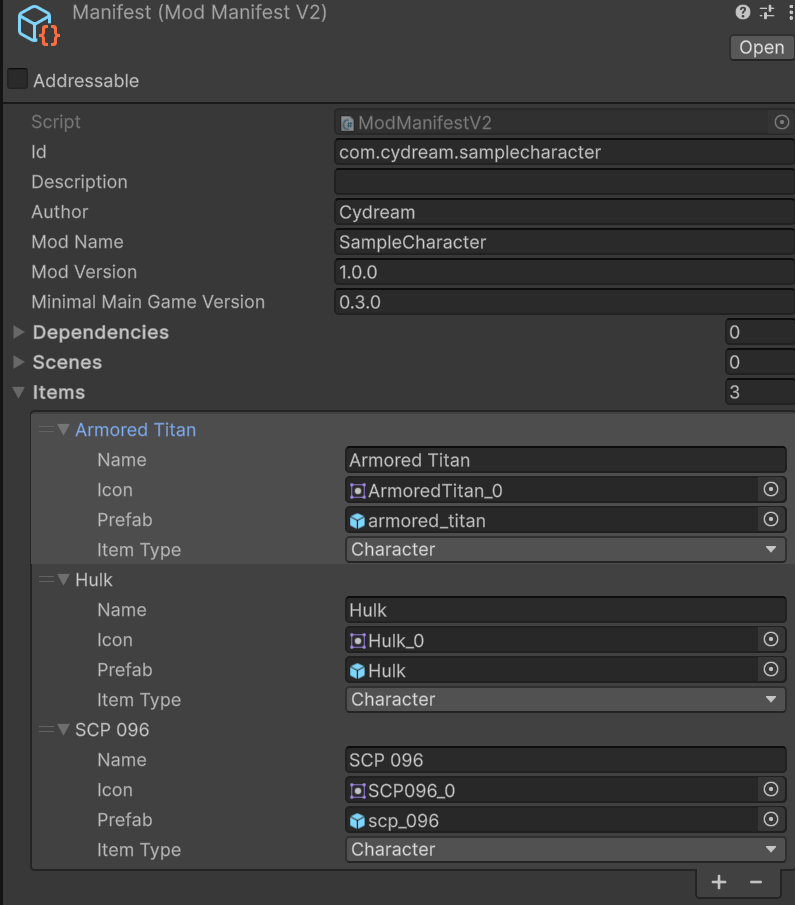

# Tutorial: Configuring a Character

This tutorial explains how to prepare a voxel character, import it into the toolkit, and align it to the in-game skeleton.

For the gameplay-side meaning of the main inspector fields, see [Character Proxy](./gameplay-character-ai-character-proxy.md). That page explains what `CharacterPresetProxy`, `CharacterSize`, `EnemyInfo`, `CharacterAIBehavior`, and the body-part slots are used for at runtime.

## Step 1: Prepare the voxel character in MagicaVoxel

Before import, split the character into separate voxel objects for each body part. Each limb should be its own voxel object so the importer can assign it to the correct skeleton slot later.

Recommended naming:

* `head`
* `chest`
* `pelvis`
* `arm_upper_l`
* `arm_lower_l`
* `hand_l`
* `arm_upper_r`
* `arm_lower_r`
* `hand_r`
* `leg_upper_l`
* `leg_lower_l`
* `foot_l`
* `leg_upper_r`
* `leg_lower_r`
* `foot_r`

The exact pose in MagicaVoxel does not matter. A T-pose, A-pose, or any other neutral pose is acceptable, and the initial character size also does not need to be exact. After import, you will align the voxel parts to the game skeleton inside the editor.

For performance, the final voxel scale should generally stay above `0.03m`. If the model is much denser than that, the voxel count can become unnecessarily high and hurt runtime performance.

## Step 2: Import the `.vox` file into the toolkit

Use **Vox Assets Processor** to create the character prefab:

1. Drag the `.vox` file into **Vox Assets Processor**.
2. Set **Convert Type** to **Character**.
3. Click **Convert**.
4. Select the generated character object in the hierarchy.
5. In the inspector, click **Auto Assign** so the importer maps the named voxel parts to the matching body slots.

After auto assign, verify that each slot points to the correct voxel object. If any names do not match the expected body part, fix them manually.

The generated prefab is mainly configured through `CharacterPresetProxy`. If you want a field-by-field explanation of those slots and gameplay options, refer to [Character Proxy](./gameplay-character-ai-character-proxy.md).

## Step 3: Tweak character settings after import

Once the character prefab has been generated, you can configure the gameplay-facing settings in the inspector:

1. Adjust **Character Size** to match the intended scale in game.
2. Set **Enemy Info** if this character should use enemy-related data.
3. Choose the appropriate **AI Behavior** for the character.
4. Use **Preview** to show the voxel body parts together with the skeleton.

These settings are independent from the original authoring pose in MagicaVoxel, so it is normal to refine them after import.

The detailed meaning of these settings is documented in [Character Proxy](./gameplay-character-ai-character-proxy.md).

If you want to configure detailed AI actions beyond selecting the basic behavior type, see [AI Actions](./gameplay-character-ai-ai-actions.md).

## Step 4: Align voxel limbs to the skeleton

After the character has been assigned and configured, align the voxel body parts to the skeleton in the scene view.

1. Preview the skeleton and voxel parts together.
2. Move and rotate each voxel limb until it lines up with the intended bone position.
3. Check the body from multiple angles and make sure the proportions look correct.
4. Ensure the arms, legs, hands, feet, chest, and head sit naturally on the rig before testing animation or gameplay.

This alignment step is what makes the imported voxel character work correctly with the in-game skeleton and animation system.

If a body slot, size preset, or gameplay setting is unclear during this step, use [Character Proxy](./gameplay-character-ai-character-proxy.md) as the reference page for the runtime character setup.

## Step 5: Setup the manifest and export

After the prefab is configured, add it to the mod manifest and export the mod package.

1. Open `manifest.asset`.
2. Add a new entry under **Items**.
3. Set **Item Type** to **Character**.
4. Fill in the display name and icon if needed.
5. Assign the generated character prefab to the **Prefab** field.
6. Verify the prefab reference points to the final aligned prefab you want to ship.
7. Save the manifest changes.

After the manifest is ready, export the mod with the standard mod export flow.

This final step makes the configured character available in the built mod package.
