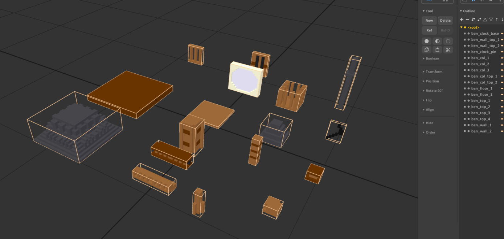
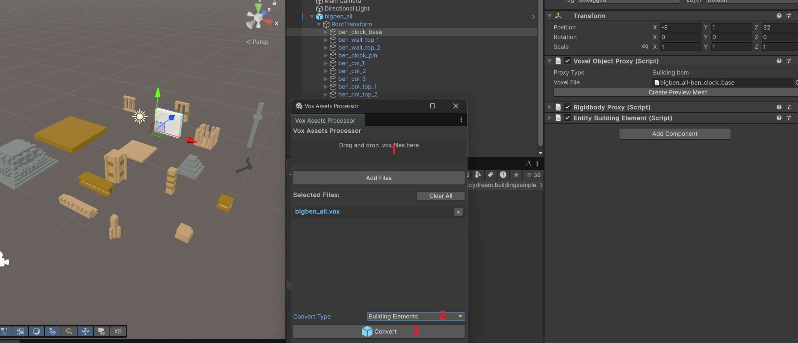
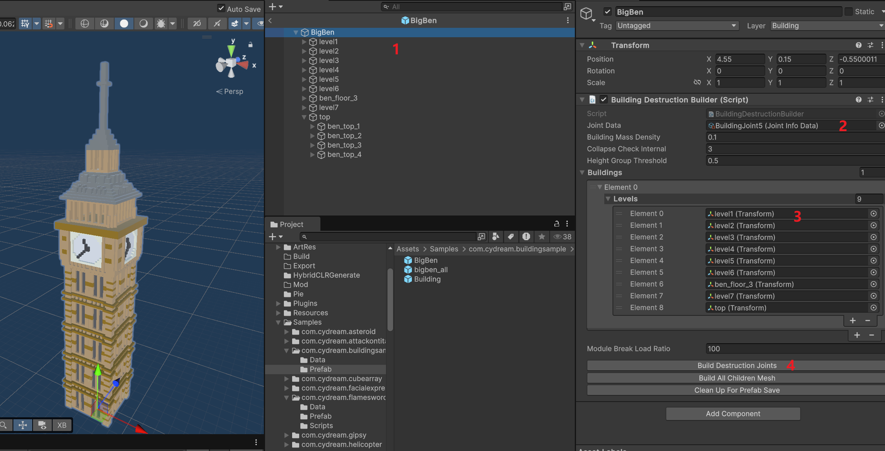
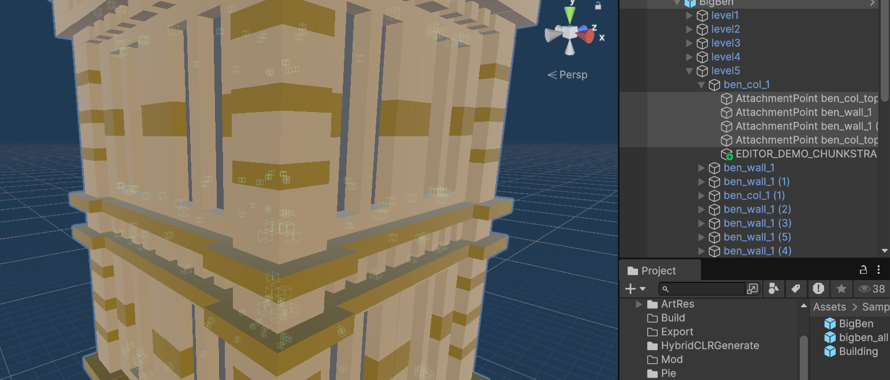

# Tutorial: Sample Building

This page introduces the building sample in `Assets/Samples/com.cydream.buildingsample`.

Buildings are different from normal scene objects. Instead of using one single voxel object, a building is usually split into modular pieces, then composed back into one structure and connected with joints so the destruction system knows how the parts should hold together and break apart.

## Prepare the building modules

Create the building in MagicaVoxel as a kit of separate modules instead of one merged object. Each module should represent a meaningful building piece that can be assembled later in Unity, such as floors, walls, columns, or roof sections.

For performance, it is better to keep the whole building under `100` pieces whenever possible.

The sample building voxel file is prepared this way, with separate modules for the full building.

## Import the voxel kit

Open the `Vox Assets Processor`, add the building `.vox` file, set `Convert Type` to `Building Elements`, and then click `Convert`.

This import step creates the voxel asset config for each kit piece, so every module can be reused when you assemble the final building prefab.

## Assemble the final building

After import, drag the generated building elements into the scene and assemble them into the final building. A common setup is to create level roots first, then place the module pieces under those roots.

On the final building root:

1. Add or open the `BuildingDestructionBuilder` component.
2. Assign the level roots into the `Buildings` list.
3. Assign the joint data asset to `Joint Data`.
4. Click `Build Destruction Joints`.

After the builder finishes, it generates many `AttachmentPoint` objects between nearby modules so the building can behave correctly in destruction.

## Use and export

Once the building prefab is assembled, you can place it in any scene like other scene content. After that, reference the prefab in `manifest.asset`, then export the mod and test it in game.
