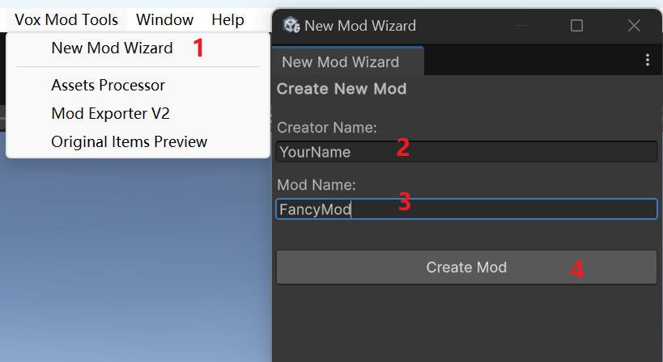
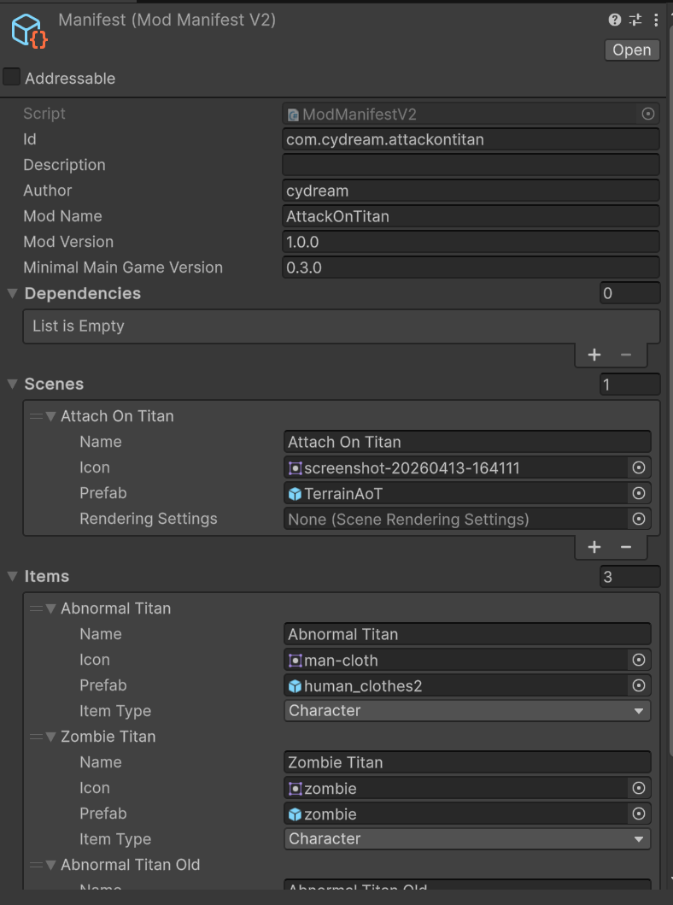

# Creating Your First Mod

This guide walks through the current workflow for creating a new mod. The toolkit now scaffolds mods for TypeScript scripting through Puerts, so you should treat TypeScript as the default gameplay scripting path.

## Step 1: Create a new mod

1. In the Unity Editor, open **Vox Mod Tools > New Mod Wizard**.
2. Enter your **Creator Name** and **Mod Name**.
3. Click **Create Mod**.



The wizard creates your mod under `Assets/Mod/com.<creator>.<modname>`.

## Step 2: Understand the generated structure

The wizard creates these folders and files for you:

* **Root folder**: Place `.vox` assets and any mod-local files here.
* **`Scripts/`**: TypeScript source files for your gameplay logic.
* **`Prefab/`**: Generated prefabs and prefab variants you want to export.
* **`Data/`**: Extra data files generated by import tools or used by your content.
* **`tsconfig.json`**: Per-mod TypeScript compiler configuration.
* **`manifest.asset`**: Your mod metadata and exporter configuration.

It also creates a starter script pair:

* **`Scripts/index.ts`** exports your gameplay class.
* **`Scripts/<modname>.ts`** contains a minimal `JsComponentProxy`-based class.

## Step 3: Author scripts in TypeScript

Mods no longer use legacy custom C# scripts as the main authoring workflow. Instead:

1. Export your gameplay class from `Scripts/index.ts`.
2. Attach **`JsComponentProxy`** to the prefab that should run the script.
3. Set the proxy's script/class name to the exported TypeScript class name.
4. Use **`JsProperties`** on the same prefab to pass references into the script when needed.

Minimal pattern:

```ts
export class MyModComponent {
    private bindTo: VX.Mod.JsComponentProxy;

    constructor(bindTo: VX.Mod.JsComponentProxy) {
        this.bindTo = bindTo;
        this.bindTo.onUpdate = (dt) => this.onUpdate(dt);
    }

    private onUpdate(deltaTime: number): void {
    }
}
```

## Step 4: Configure the manifest

Open `manifest.asset` in your mod root and fill in the metadata for your mod.



Most importantly:

* Add every prefab you want to ship to **Export Prefabs**.
* Keep the version fields updated before packaging a release.

## Step 5: Build and export

After importing assets and configuring your prefabs:

1. Open **Vox Mod Tools > Mod Exporter**.
2. Select your mod.
3. Build the target platform.
4. Install locally or package the output for mod.io.

The exporter writes builds to the project's `Assets/Export` pipeline output used by the toolkit.
