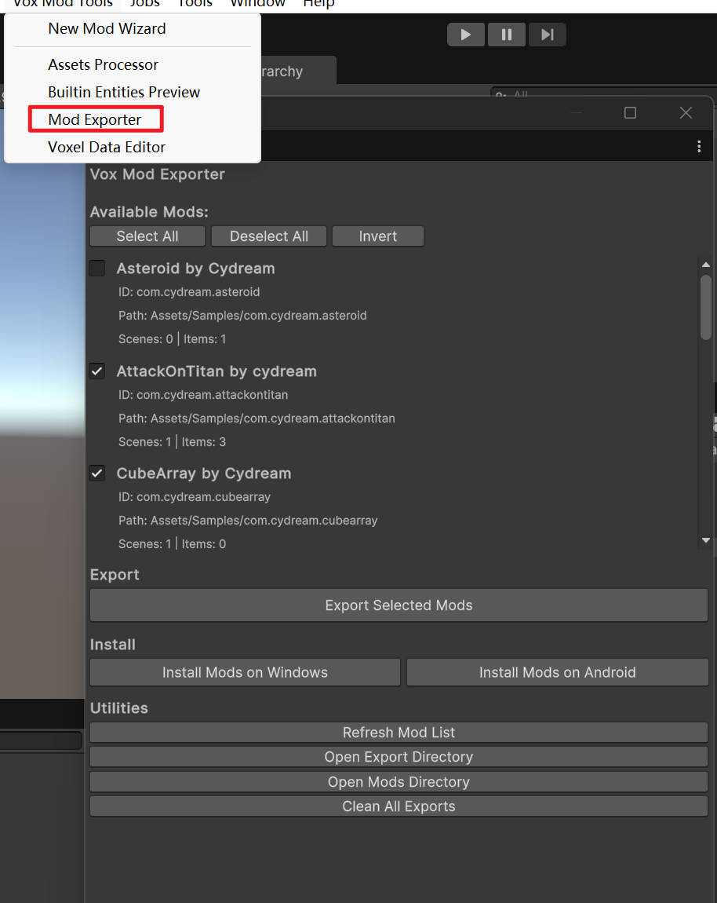

# Test Mod

This guide explains how to validate, install, and test a mod built with the current TypeScript-based toolkit workflow.

## 1. Validate TypeScript before export

Install the `Puer-Project` dependencies first, then run the per-mod lint step from that same folder:

```cmd
cd /Puer-Project
npm install
```

After that, run:

```cmd
cd /Puer-Project
npm run lint:mod -- com.yourname.yourmod
```

Use this to catch missing exports, type errors, and common script issues before you package the mod.

## 2. Build and install the mod

### Option A: Mod Exporter

Use the **Mod Exporter** window in Unity for the normal workflow.



1. Open **Vox Mod Tools > Mod Exporter**.
2. Select your mod.
3. Build for the target platform.
4. Install the built mod to your local game instance.

### Option B: Manual installation

If you need to move the build to another machine:

1. Build the mod in the exporter.
2. Locate the exported output for your platform.
3. Copy the full mod folder into the game's `Mods` directory.

Windows mods are loaded from:

```text
%userprofile%\AppData\LocalLow\Cydream\Voxel Playground\Mods\
```

The game loads valid mod folders from that directory on startup.

## 3. Verify the prefab-script wiring

For TypeScript gameplay logic, most runtime failures come from prefab setup rather than compilation. Check these first:

* The prefab has a **`JsComponentProxy`** component.
* The proxy script name matches the exported TypeScript class name exactly.
* `Scripts/index.ts` exports the class used by the prefab.
* Any required object references are assigned through **`JsProperties`**.
* The prefab is included in `manifest.asset`.

## 4. Read logs

Use logs to confirm the script was instantiated and to diagnose missing bindings.

### VR mode

1. Start the game.
2. Open **Settings > Dev > Console**.
3. Read the log output from the in-game console.

> Note: the in-game console is available in development builds.

### Flatscreen mode

If you are testing without VR, use the player log:

```text
%userprofile%\AppData\LocalLow\Cydream\Voxel Playground\Player.log
```

## 5. Use flatscreen mode for fast iteration

You can launch the game with `--flatscreen` for faster desktop testing:

```cmd
Voxel Playground.exe --flatscreen
```

Common controls:

* **Move**: `W`, `A`, `S`, `D`
* **Look**: Mouse
* **Jump**: `Space`
* **Hands / fire**: Mouse buttons and number keys depending on the held item

For script-heavy mods, flatscreen mode is usually the fastest way to verify prefab setup and gameplay loops before switching to VR testing.
